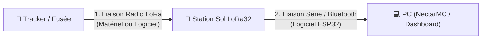

# Guide Complet sur les 2 Niveaux de Contrôle d'Intégrité (CRC)

Ce guide est destiné aux utilisateurs de la station au sol **RocketStation-LoRa32** (débutants ou initiés) afin de comprendre comment l'intégrité des données est préservée tout au long du trajet de la fusée/ballon jusqu'à l'ordinateur de contrôle.

Pour garantir qu'aucune donnée n'est perdue ou corrompue, la station utilise **deux niveaux de contrôle d'intégrité (CRC)** distincts :

---

## 🔍 Niveau 1 : La Liaison Radio LoRa (Tracker ➔ Station Sol)

Ce contrôle vérifie que les paquets radio reçus dans les airs n'ont pas été altérés par le bruit de fond électromagnétique, la distance ou les obstacles. Il existe deux manières de le configurer sur la station :

### Option A : Le CRC Matériel (Recommandé & Par défaut)

C'est l'option standard configurée au démarrage de la station.

*   **Qui fait le travail ?** Le calcul et la validation du CRC sont faits directement **en silicium par la puce radio Semtech SX1276**, libérant totalement le processeur de la carte ESP32.
*   **Rôle de RadioLib** : La bibliothèque RadioLib sert simplement à configurer les registres internes du composant. La fonction `radio->setCRC(bool enable, bool mode = false)` modifie le registre interne `RegModemConfig1` (bit `RxPayloadCrcOn`) du circuit intégré.
*   **Fonctionnement à l'émission** : L'émetteur (le tracker) calcule une signature CRC16 standard CCITT (polynôme $X^{16} + X^{12} + X^5 + 1$) sur sa charge utile et l'ajoute automatiquement à la fin de la trame radio physique.
*   **Fonctionnement à la réception** : La puce SX1276 du récepteur décode le paquet, recalcule la signature et la compare à celle présente en fin de trame :
    *   **Si les signatures concordent** : Le paquet est intègre. La puce déclenche une interruption matérielle (`DIO0`), et l'ESP32 peut copier le paquet validé.
    *   **Si les signatures diffèrent** : La puce radio active le bit d'erreur `PayloadCrcError` dans son registre d'interruptions (`RegIrqFlags`). La bibliothèque RadioLib intercepte cette alerte, rejette immédiatement le paquet et renvoie une erreur `RADIOLIB_ERR_CRC_MISMATCH`. L'ESP32 ignore alors silencieusement ce paquet corrompu.
*   **Commandes AT associées** :
    *   `AT+CRC=1` : Active le CRC matériel en mode CCITT.
    *   `AT+CRC=1,1` : Active le CRC matériel en mode IBM (polynôme $X^{16} + X^{15} + X^2 + 1$).
    *   `AT+CRC=0` : Désactive le CRC matériel.

---

### Option B : Le CRC Logiciel (Si le CRC matériel est désactivé)

*   **Qui fait le travail ?** Le **code informatique** écrit par l'utilisateur sur le microcontrôleur du tracker (qui calcule et ajoute le CRC à l'émission) et le **code de la station sol** (qui le vérifie en logiciel avant de l'envoyer au PC).
*   **Fonctionnement** : 
    * Si le CRC matériel est désactivé (`AT+CRC=0`), la puce radio SX1276 n'effectue aucun test en silicium et accepte tous les paquets reçus. 
    * Pour sécuriser la transmission, le code de votre émetteur (tracker) doit calculer une somme de contrôle CRC16 (polynôme CCITT) et l'insérer en queue du paquet radio LoRa.
    * À la réception, l'ESP32 de la station sol lit les données et effectue le calcul du CRC16 logiciel en C++ (voir [radio.cpp](file:///c:/Users/paulm/OneDrive/Documents/PlatformIO/Projects/RocketStation-LoRa32/src/radio.cpp#L295-L318)). 
        * *Si le CRC logiciel est valide* : L'ESP32 valide le paquet, retire les 2 octets du CRC logiciel de la charge utile (pour que la charge utile de données soit identique au mode matériel pour le PC), et transmet le reste.
        * *Si le CRC logiciel est invalide* : Il incrémente le compteur d'erreurs (`errCount`), met à jour l'afficheur OLED avec le message `"CRC Error (Soft)"` et rejette silencieusement le paquet.
*   **Pourquoi faire cela ?** Bien que la station sol filtre désormais les trames corrompues dans les deux modes (matériel et logiciel) pour éviter d'envoyer des données erronées au PC, utiliser un CRC logiciel LoRa permet à l'émetteur de conserver un contrôle applicatif complet sur son intégrité ou de contourner les limitations de certaines puces radio.

---

## 🔍 Niveau 2 : La Liaison Série & Bluetooth (Station Sol ➔ PC)

Une fois que la station sol a reçu un paquet radio valide, elle l'encapsule avec ses métadonnées (puissance du signal RSSI, rapport signal/bruit SNR, horloge de réception RTC) pour l'envoyer à votre ordinateur (via USB ou Bluetooth). Un **CRC Logiciel** est alors appliqué pour cette dernière étape.

*   **Qui fait le travail ?** Le processeur de l'**ESP32** (côté station sol) et le **logiciel de traitement** (côté PC, comme NectarMC ou le Dashboard Web).
*   **Fonctionnement** :
    1. Dans le fichier [serial.cpp](file:///c:/Users/paulm/OneDrive/Documents/PlatformIO/Projects/RocketStation-LoRa32/src/serial.cpp), l'ESP32 prépare le message série final au format binaire NectarMC.
    2. Il calcule un **CRC16-CCITT logiciel** sur l'ensemble de la trame (Header + Payload LoRa + RSSI + SNR + Timestamp).
    3. Il transmet le message sur le port série USB ou Bluetooth en y ajoutant en queue les 2 octets du CRC logiciel calculé.
    4. À la réception, le Dashboard ou NectarMC effectue le même calcul logiciel. Si un bit a été corrompu par un faux contact du câble USB ou des parasites Bluetooth, la trame est rejetée, empêchant l'affichage de fausses valeurs à l'écran.

---

## Synthèse en un coup d'œil

| Étape de Liaison | Type de CRC | Acteur Principal | Que se passe-t-il en cas d'erreur ? |
| :--- | :--- | :--- | :--- |
| **1. Radio LoRa** (Option A) | **Matériel** | Puce Semtech SX1276 | Le paquet est supprimé directement en silicium. L'ESP32 ne le reçoit pas. |
| **1. Radio LoRa** (Option B) | **Logiciel** | Code émetteur & ESP32 | L'ESP32 vérifie le CRC logiciel. S'il est faux, il affiche une erreur sur l'OLED et détruit le paquet. S'il est valide, il retire le CRC et l'envoie au PC. |
| **2. Série USB / BT** | **Logiciel** | Code ESP32 & NectarMC | Le logiciel sur le PC ignore la trame série pour éviter d'afficher des données aberrantes. |
