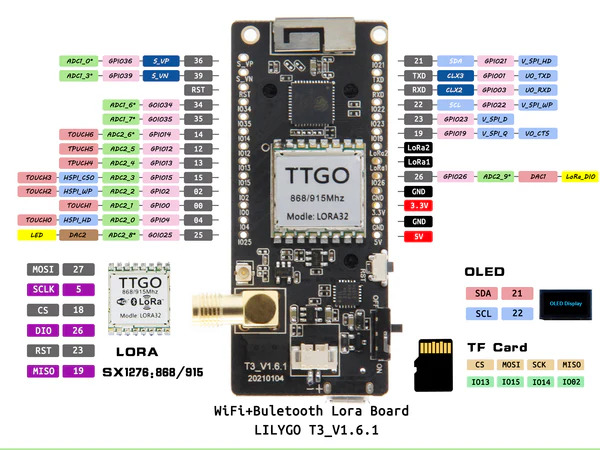
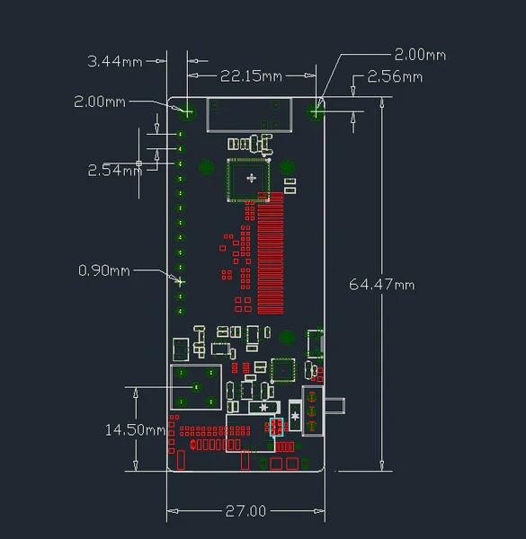
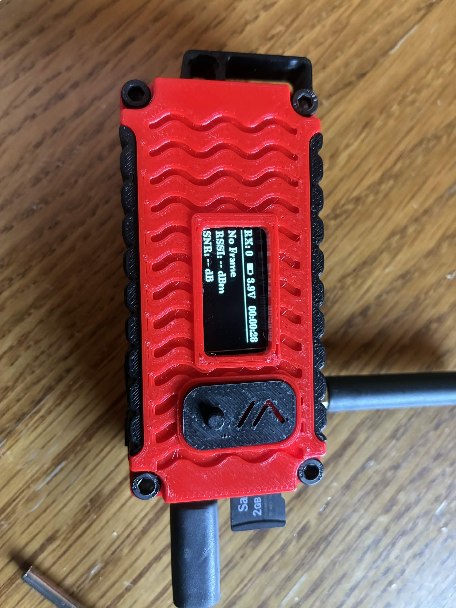
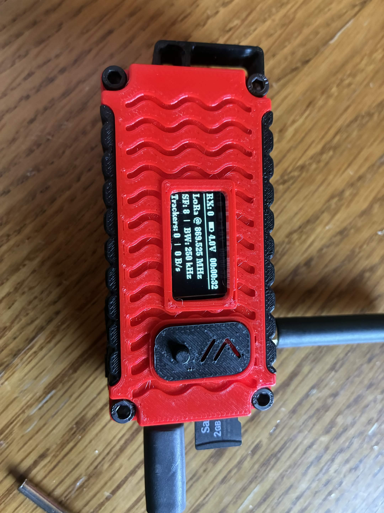
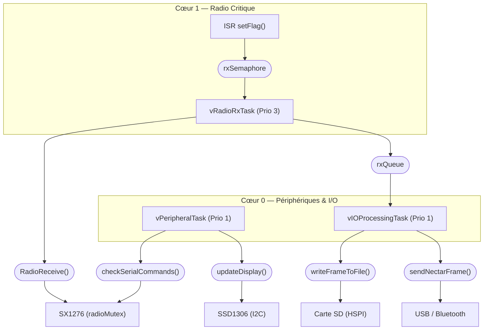
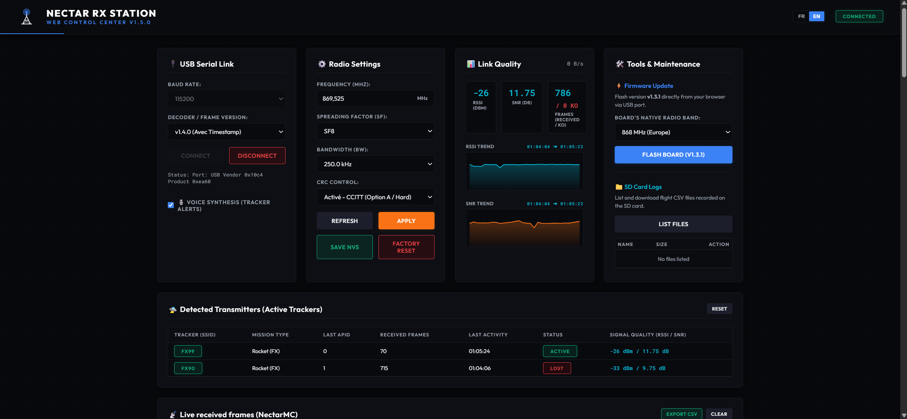

# NECTAR RX STATION - LoRa32 (Station Sol Nectar)

**NECTAR RX STATION - LoRa32** est la station au sol de réception LoRa officielle de l'écosystème **Nectar**, destinée à capter la télémétrie de fusées expérimentales et de ballons-sondes. Elle repose sur la carte de développement [LilyGO TTGO T3 V1.6.1 (LoRa32 V2.1.6)](https://lilygo.cc/en-us/products/lora3) équipée d'un microcontrôleur ESP32, d'un module radio SX1276 et d'un écran OLED intégré. Elle fonctionne à la fréquence de 869.525 MHz (868 MHz ou 433 Mhz Bande ICM en fonction de la version).

Elle est notamment pleinement compatible avec le tracker d'émission officiel de l'écosystème : [Wasp-TxTracker-TTGO](https://github.com/axpaul/Wasp-TxTracker-TTGO), ainsi qu'avec le logiciel de visualisation et de traitement de télémétrie au sol [NectarMC](https://github.com/mlavardin/NectarMC).

<p align="center">
  
</p>

Cette version du logiciel est optimisée pour être compatible avec le logiciel [NectarMC](https://github.com/mlavardin/NectarMC) en générant des trames binaires série conformes, en gérant dynamiquement les trackers et en enregistrant l'historique sur carte SD.

---

## Aperçu du Matériel

Voici les vues de la carte de développement ainsi que son brochage (Pinout) et ses dimensions :

<p align="center">
  
  <br>
  <em>Brochage de la carte TTGO LoRa32</em>
</p>
<p align="center">
  
  <br>
  <em>Format de la carte LoRa32</em>
</p>


**[Télécharger la Fiche Technique et le Schéma PDF Officiel de la TTGO T3 V1.6.1](T3_V1.6.1.pdf)**

---

## Fonctionnalités principales

*   **Compatibilité NectarMC** : Génère à la volée des trames binaires série structurées (Magic byte `0xEB`, `Id_mission` codé sur 16 bits en Little-Endian, calcul du `CRC16-CCITT` en Little-Endian) prêtes à être décodées et affichées en temps réel par le logiciel [NectarMC](https://github.com/mlavardin/NectarMC).
*   **Réception LoRa dynamique** : Supporte des longueurs de paquets LoRa variables de manière totalement transparente.
*   **Robustesse radio** : Utilise le CRC matériel du module SX1276 pour garantir l'intégrité de la liaison RF (les trames corrompues en vol sont directement jetées par le silicium).
*   **Journalisation CSV incrémentale** : Crée un fichier par session de démarrage (`/log_0.csv`, `/log_1.csv`, etc.) pour éviter d'écraser vos données de vol précédentes.
*   **Suivi de l'alimentation** : Mesure la tension de la batterie en temps réel (via le pin ADC GPIO 35) et détecte si la station est alimentée en USB.

---

## Description de l'Affichage OLED et des Menus

L'écran OLED (128x64 pixels) affiche des informations complètes sur l'état de fonctionnement du récepteur. Au démarrage, il affiche une **animation de pylône radio émetteur** avec des ondes électromagnétiques clignotantes, puis affiche un retour visuel sur l'état de la carte SD (un **icône de coche de validation** en cas de succès, ou un **triangle d'alerte clignotant** si la carte est absente/défectueuse).

Pendant le fonctionnement, l'écran est structuré en deux parties :

### 1. En-tête Persistant (Ligne 1 - Toujours visible)
*   **Gauche** : Compteur de paquets reçus (et d'erreurs éventuelles), ex: `RX: 12` ou `RX:12 E:2`.
*   **Milieu** : Statut de l'alimentation. Affiche `USB` avec une icône de batterie pleine s'il est alimenté par câble USB, ou affiche la tension de la batterie en volts (ex: `3.9V`) avec une icône de jauge proportionnelle au niveau de charge.
*   **Droite** : Horloge temps réel (RTC) comptant le temps écoulé depuis le démarrage (`HH:MM:SS`).

### 2. Rotation des Écrans Principaux (Alternance toutes les 4 secondes)

Les informations détaillées s'affichent sous forme de deux écrans alternant automatiquement toutes les 4 secondes :

| Écran 1 : Infos de la dernière trame                                                                                                      | Écran 2 : Configuration & Stats réseau                                                                                                    |
| :---------------------------------------------------------------------------------------------------------------------------------------: | :---------------------------------------------------------------------------------------------------------------------------------------: |
|                                                                                               |                                                                                               |
| **Dernier paquet reçu** : Affiche le SSID décodé, l'APID de l'émetteur, ainsi que le RSSI (dBm) et le SNR (dB) physiques du signal capté. | **Configuration & Débit** : Affiche la fréquence active, le Spreading Factor (SF), la bande passante (BW), les trackers et le débit.     |

---

## Format des Trames (Radio & Série NectarMC)

Les données transitent sous deux formats de trames différents selon le canal (Liaison Radio LoRa dans les airs, ou Liaison Série USB / Bluetooth vers le PC) :
*   **Trames Radio LoRa (Air)** : Trames simplifiées émises par les trackers, avec ou sans signature CRC selon l'option choisie.
*   **Trames Série NectarMC (USB / Bluetooth)** : Trames binaires enrichies de métadonnées (RSSI, SNR, horodatage de réception RTC, et signature CRC globale).

Pour consulter les schémas binaires complets, les descriptions détaillées de chaque octet et les tables d'encodage :
👉 **[Consulter le Guide des Formats de Trames](./FRAME_GUIDE.md)**

---

## Contrôle d'Intégrité (CRC) et de Liaison

Pour garantir la fiabilité de la transmission des données de la fusée jusqu'à votre écran, deux niveaux de contrôle d'intégrité (CRC) sont appliqués :
1. **Liaison Radio LoRa (Tracker ➔ Station Sol)** : CRC matériel géré en silicium par le SX1276 (Option A, par défaut), ou CRC logiciel inséré dans la payload LoRa et validé en C++ par la station sol (Option B).
2. **Liaison Série & Bluetooth (Station Sol ➔ PC)** : CRC logiciel calculé par l'ESP32 et vérifié à la réception par le PC (NectarMC ou Dashboard Web).

Pour une explication détaillée de ces deux niveaux de sécurité et un guide pas-à-pas idéal pour les débutants :
👉 **[Consulter le Guide complet sur les CRC](./CRC_GUIDE.md)**

## Commandes de Configuration AT (Série / Bluetooth)

La station sol dispose d'un décodeur interactif de commandes AT permettant de configurer la radio à chaud (en USB à **115200 bauds** ou sans fil en **Bluetooth SPP**).

Pour garantir une communication fluide et éviter tout conflit avec les données binaires de télémétrie de la fusée, toutes les commandes d'administration doivent commencer par le préfixe **`AT`**.

Pour la liste complète des commandes, leurs paramètres autorisés et le format de leurs réponses :
👉 **[Consulter la Liste des Commandes AT](./AT_GUIDE.md)**

---

## Structure des logs (Carte SD)

Les données sont enregistrées dans un fichier CSV avec la structure suivante :
`Timestamp,RSSI,SNR,SSID,APID,RawFrame`

Exemple de ligne de log :
`00:05:42,-85.00,8.50,FX99,7,EBC7181401020304`

---

## Architecture Logicielle & Multitâche Temps Réel

Le micrologiciel du récepteur est architecturé autour de l'OS temps réel **FreeRTOS** intégré au framework Arduino de l'ESP32. Il exploite les deux cœurs de la puce (Dual-Core) afin de séparer les tâches critiques (réception radio instantanée) des traitements lourds et potentiellement bloquants (écriture sur carte SD, pile Bluetooth).



### Mécanismes de synchronisation
1. **Sémaphore Binaire (`rxSemaphore`)** : L'interruption DIO0 (`setFlag()`) libère le sémaphore depuis l'IRAM. La tâche `vRadioRxTask` (Prio 3, Cœur 1), en attente bloquante, se réveille instantanément pour lire la trame.
2. **File d'Attente (`rxQueue`)** : Les paquets LoRa validés sont encapsulés dans une structure `LoRaPacket` et poussés dans la file. La tâche d'E/S les récupère sur le Cœur 0 de manière asynchrone.
3. **Mutex Radio (`radioMutex`)** : Protège le bus SPI de la radio contre les accès concurrents lors de l'application de commandes AT à chaud (changement de fréquence, SF, BW, etc.) pendant la réception active.
4. **Spinlock Display (`dispMux`)** : Protège les variables d'affichage partagées (`dispStatus`, `dispRssi`, `dispSnr`, etc.) entre le Cœur 1 (écriture par `RadioReceive`) et le Cœur 0 (lecture par `updateDisplay`) via des sections critiques `taskENTER_CRITICAL` / `taskEXIT_CRITICAL`.

### Description des Modules

*   **[main.cpp](./src/main.cpp)** : Point d'entrée principal. Il initialise les périphériques, crée les tâches FreeRTOS épinglées sur les cœurs et cadence le rafraîchissement d'afficheur.
*   **[radio.cpp](./src/radio.cpp)** : Initialise le module SX1276 et contient la routine de service d'interruption (ISR) ainsi que la fonction de lecture bas niveau `RadioReceive()`.
*   **[display.cpp](./src/display.cpp)** : Gère le rendu sur l'écran OLED U8g2 (animations de démarrage, menus de télémétrie en rotation et indicateurs de batterie/Bluetooth).
*   **[at_commands.cpp](./src/at_commands.cpp)** : Analyseur syntaxique de la console AT interactive (USB & Bluetooth SPP). Permet également la surveillance de la **pile libre (Stack High Water Mark)** de chaque tâche FreeRTOS via la commande `AT+CFG`.
*   **[serial.cpp](./src/serial.cpp)** : Encode les trames au format binaire NectarMC (avec CRC16-CCITT) et les pousse sur la liaison série USB et Bluetooth.
*   **[function.cpp](./src/function.cpp)** : Gère le stockage CSV sur carte SD (bus HSPI indépendant) et la sauvegarde de configuration dans la mémoire flash non-volatile (NVS).
*   **[header.h](./include/header.h)** : Déclare les types, structures, variables globales et constantes de pinout matérielles du projet.

---

## External Libraries

Les dépendances du projet sont gérées via `platformio.ini`. 
Les bibliothèques suivantes sont requises pour le fonctionnement du firmware :

| Library | Version | Purpose |
| :--- | :--- | :--- |
| **RadioLib** | `^6.0.0` | Gestion de la communication radio LoRa |
| **ESP32Time** | `^2.0.0` | Gestion de l'horloge interne (RTC) |
| **U8g2** | `^2.34.18` | Gestion de l'affichage OLED |

---

## Tests Unitaires (Stabilité des tâches & CRC)

Pour prévenir les risques d'overflow de pile (*stack overflow*) inhérents au multitâche FreeRTOS et valider la logique d'intégrité, une suite de tests unitaires sous le framework **Unity** est intégrée au projet.

Le test `test_task_stacks_high_water_mark` instancie des tâches miroirs avec les allocations mémoire du firmware réel (4 Ko pour la radio, 8 Ko pour les E/S), leur fait exécuter des calculs lourds, et vérifie via `uxTaskGetStackHighWaterMark` qu'il reste au moins 10% d'espace de sécurité libre dans chaque pile.

Pour exécuter les tests unitaires PlatformIO sur cible :
```powershell
C:\Users\paulm\.platformio\penv\Scripts\pio.exe test -e ttgo-lora32-v21-868
```

---

## Compilation et Flashage

Le projet utilise **PlatformIO**. Pour compiler et flasher le récepteur :

1. Ouvrez le projet dans VS Code avec l'extension PlatformIO.
2. Connectez votre carte TTGO LoRa32 v2.1.6 via USB.
3. Lancez la compilation et le téléversement (Upload).

En ligne de commande :
```powershell
pio run -t upload
```

---

## Outils de l'Écosystème NectarMC

> [!IMPORTANT]
> Pour exploiter pleinement votre station sol **NECTAR RX STATION - LoRa32**, vous pouvez utiliser les deux solutions logicielles officielles :
> 
> ### 1. Console Web de Contrôle & Flasheur en Ligne
> Une interface web moderne et statique est disponible sans aucune installation requise. Elle communique en direct avec votre récepteur en USB :
> 👉 **[Ouvrir la Nectar Rx Station Web Console (Live)](https://axpaul.github.io/Nectar-RxStation-LoRa32/)**
> 
> Cette console web vous permet de :
> *   **Piloter la station par port COM USB** : Connectez votre récepteur LoRa32 en un clic et configurez-le dynamiquement (fréquence, Spreading Factor, Bande Passante) à l'aide de boutons simples ou de la console AT interactive.
> *   **Suivre les Trackers Actifs en temps réel** : La page liste automatiquement tous les émetteurs détectés (fusées, minifusées, ballons...) avec leurs types de mission, APID, nombre de trames et charges utiles. Elle détecte et marque automatiquement comme `PERDU` les trackers inactifs pendant plus de 15 secondes.
> *   **Tracer le débit de données** : Un graphique SVG en temps réel affiche le flux instantané de données reçues.
> *   **Flasher le firmware en ligne** : Mettez à jour le micrologiciel de votre carte TTGO avec la version **v1.3.1** native (en 868 ou 433 MHz) directement en un clic depuis le navigateur grâce à `esptool-js`.
> ### 2. Logiciel de Traitement & Visualisation 3D : NectarMC
> La station sol est entièrement configurée pour transmettre les données de vol en temps réel vers le logiciel principal de visualisation de la télémétrie :
> 👉 **[Découvrir NectarMC sur GitHub](https://github.com/mlavardin/NectarMC)**

<p align="center">
   
   <br>
   <em>Vue du site web actuel de Nectar Rx Station Web Console</em>
</p>

---

## Auteur

*   **Paul Miailhe ([axpaul](https://github.com/axpaul))** :
    *   **Concepteur principal** du projet matériel et logiciel de la station de réception sol **NECTAR RX STATION - LoRa32**.
    *   **Version originale (MSE)** : Juin 2023.
    *   **Refonte & Améliorations** : Mai/Juin 2026 (Intégration du protocole binaire NectarMC, animation graphique live de pylône OLED, décodeur et gestionnaire de trackers dynamiques et interface Web de contrôle/flashage en ligne par Web Serial API).
