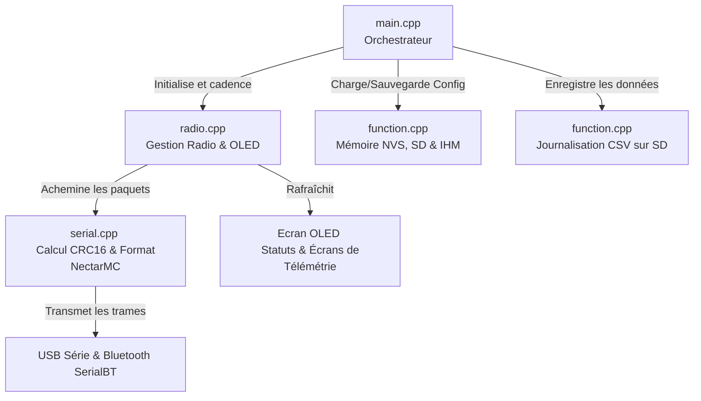

# RocketStation-LoRa32 (Récepteur NectarMC)

**RocketStation-LoRa32** est une station au sol de réception LoRa destinée à capter la télémétrie de fusées expérimentales et de ballons-sondes. Elle repose sur la carte de développement [LilyGO TTGO T3 V1.6.1 (LoRa32 V2.1.6)](https://lilygo.cc/en-us/products/lora3) équipée d'un microcontrôleur ESP32, d'un module radio SX1276 et d'un écran OLED intégré. Elle fonctionne à la fréquence de 869.525 MHz (868 MHz ou 433 Mhz Bande ICM en fonction de la version).

Le but principal de cette station est d'assurer l'interface de réception physique pour le logiciel de visualisation et de traitement de télémétrie [NectarMC](https://github.com/mlavardin/NectarMC).

<p align="center">
  
</p>

Cette version du logiciel est optimisée pour être compatible avec le logiciel [NectarMC](https://github.com/mlavardin/NectarMC) en générant des trames binaires série conformes, en gérant dynamiquement les trackers et en enregistrant l'historique sur carte SD.

---

## 📸 Aperçu du Matériel

Voici les vues de la carte de développement ainsi que son brochage (Pinout) et ses dimensions :

<p align="center">
  
</p>
<p align="center">
  
</p>

👉 **[Télécharger la Fiche Technique et le Schéma PDF Officiel de la TTGO T3 V1.6.1](T3_V1.6.1.pdf)**

---

## 🚀 Fonctionnalités principales

*   **Compatibilité NectarMC** : Génère à la volée des trames binaires série structurées (Magic byte `0xEB`, `Id_mission` codé sur 16 bits en Little-Endian, calcul du `CRC16-CCITT` en Little-Endian) prêtes à être décodées et affichées en temps réel par le logiciel [NectarMC](https://github.com/mlavardin/NectarMC).
*   **Réception LoRa dynamique** : Supporte des longueurs de paquets LoRa variables de manière totalement transparente.
*   **Robustesse radio** : Utilise le CRC matériel du module SX1276 pour garantir l'intégrité de la liaison RF (les trames corrompues en vol sont directement jetées par le silicium).
*   **Journalisation CSV incrémentale** : Crée un fichier par session de démarrage (`/log_0.csv`, `/log_1.csv`, etc.) pour éviter d'écraser vos données de vol précédentes.
*   **Suivi de l'alimentation** : Mesure la tension de la batterie en temps réel (via le pin ADC GPIO 35) et détecte si la station est alimentée en USB.

---

## 📺 Description de l'Affichage OLED et des Menus

L'écran OLED (128x64 pixels) affiche des informations complètes sur l'état de fonctionnement du récepteur. Au démarrage, il affiche une **animation de pylône radio émetteur** avec des ondes électromagnétiques clignotantes, puis affiche un retour visuel sur l'état de la carte SD (un **icône de coche de validation** en cas de succès, ou un **triangle d'alerte clignotant** si la carte est absente/défectueuse).

Pendant le fonctionnement, l'écran est structuré en deux parties :

### 1. En-tête Persistant (Ligne 1 - Toujours visible)
*   **Gauche** : Compteur de paquets reçus (et d'erreurs éventuelles), ex: `RX: 12` ou `RX:12 E:2`.
*   **Milieu** : Statut de l'alimentation. Affiche `USB` avec une icône de batterie pleine s'il est alimenté par câble USB, ou affiche la tension de la batterie en volts (ex: `3.9V`) avec une icône de jauge proportionnelle au niveau de charge.
*   **Droite** : Horloge temps réel (RTC) comptant le temps écoulé depuis le démarrage (`HH:MM:SS`).

### 2. Rotation des Écrans Principaux (Alternance toutes les 4 secondes)

Les informations détaillées s'affichent sous forme de deux écrans alternant automatiquement toutes les 4 secondes :

| Écran 1 : Infos de la dernière trame | Écran 2 : Configuration & Stats réseau |
| :---: | :---: |
|  |  |
| **Dernier paquet reçu** : Affiche le SSID décodé, l'APID de l'émetteur, ainsi que le RSSI (dBm) et le SNR (dB) physiques du signal capté. | **Configuration & Débit** : Affiche la fréquence active, le Spreading Factor (SF), la bande passante (BW), le nombre de trackers actifs uniques et le débit de données instantané. |

---

## 🛰️ Structure des trames LoRa (Émetteurs)

Pour que la station puisse router dynamiquement les trames vers le logiciel [NectarMC](https://github.com/mlavardin/NectarMC), les émetteurs/trackers doivent envoyer un paquet radio LoRa structuré comme suit :

| Position | Type | Rôle | Description |
| :--- | :--- | :--- | :--- |
| **Octet 0** | `uint8_t` | `SSID_NUM` | ID ou numéro de la mission (de 0 à 255) |
| **Octet 1** | `uint8_t` | `APID` | Type d'application / de paquet (de 0 à 63) |
| **Octet 2** | `uint8_t` | `SSID_TYPE` | Type de mission (`0` = FX, `1` = MF, `2` = BALLOON, `3` = OTHER) |
| **Octets 3 à L-1** | `uint8_t[]` | `Payload` | Données brutes des capteurs (taille variable L-3) |

---

## 💻 Format de trame série NectarMC (Sortie USB)

Les trames émises par la station sol vers le PC sur le port série USB sont lues par le logiciel [NectarMC](https://github.com/mlavardin/NectarMC) pour affichage et traitement. Elles ont la structure binaire suivante (taille totale : $6 + N$ octets) :

```
┌───────────────────────────────────────────┬──────────────┬─────────────────┐
│                 HEADER                    │   PAYLOAD    │ PACKET CONTROL  │
├───────────────────────────────────────────┼──────────────┼─────────────────┤
│   MAGIC     │  Id_mission  │ payload_size │   N bytes    │     CRC16       │
│   1 Byte    │   2 Bytes    │   1 Byte     │              │    2 Bytes      │
│    0xEB     │ (Little-End) │              │              │  (Little-End)   │
└─────────────┴──────────────┴──────────────┴──────────────┴─────────────────┘
```

*   **MAGIC** : `0xEB` (Marqueur de synchronisation).
*   **Id_mission** : Fusion du SSID (TYPE sur bits 15-14, NUM sur bits 13-6) et de l'APID (bits 5-0) sur 16 bits.
*   **payload_size** : Nombre d'octets $N$ de données utiles (sans l'en-tête LoRa).
*   **CRC16** : Calculé sur le Header + Payload (polynôme CCITT 0x1021, init 0xFFFF).

---

## 🎮 Commandes de Configuration AT Interactives (Série / Bluetooth)

La station sol dispose d'un décodeur de commandes AT standard permettant de configurer la radio à chaud (en USB à **115200 bauds** ou sans fil via liaison **Bluetooth Classic (SPP)** avec l'appareil **`Nectar-RxStation-XXXX`**).

Chaque commande doit se terminer par un retour chariot (`\n` ou `\r`). Les réponses sont renvoyées sur le même canal que celui d'où provient la commande.

> [!IMPORTANT]
> **Sécurité Anti-Conflit :**
> Toutes les commandes doivent obligatoirement commencer par le préfixe **`AT`**. Tout flux série ou Bluetooth ne débutant pas par ces deux lettres est silencieusement ignoré. Cela évite tout conflit avec des trames de données binaires entrantes ou du bruit sur le port.

### 📋 Liste des commandes AT disponibles

| Commande | Rôle | Format de Réponse & Exemples |
| :--- | :--- | :--- |
| **`AT`** | Teste la communication avec la station | `OK` |
| **`AT+FREQ=<val>`** | Modifie la fréquence LoRa active (en MHz) | Ex: `AT+FREQ=869.525`. Renvoie `OK` ou `ERROR`. |
| **`AT+FREQ?`** | Interroge la fréquence active | Renvoie `+FREQ: 869.525` suivi de `OK` |
| **`AT+SF=<val>`** | Modifie le Spreading Factor LoRa | De `6` à `12`. Ex: `AT+SF=8`. Renvoie `OK` ou `ERROR`. |
| **`AT+SF?`** | Interroge le Spreading Factor actif | Renvoie `+SF: 8` suivi de `OK` |
| **`AT+BW=<val>`** | Modifie la bande passante LoRa (en kHz) | Valeur $> 0$. Ex: `AT+BW=250.0`. Renvoie `OK` ou `ERROR`. |
| **`AT+BW?`** | Interroge la bande passante active | Renvoie `+BW: 250.0` suivi de `OK` |
| **`AT+CFG`** ou **`AT+STATUS`** | Affiche le rapport complet de la configuration | Affiche la version, la bande native, les limites, les réglages actifs, l'état de la SD et du Bluetooth, suivi de `OK`. |
| **`AT+SAVE`** | Persiste la configuration active dans la Flash (NVS) | Renvoie `OK`. Elle sera rechargée automatiquement au boot. |
| **`AT+RESET`** | Efface la configuration personnalisée et redémarre | Renvoie `OK`, puis réinitialise la carte aux paramètres d'usine. |

### ⚠️ Retours d'erreurs et statuts

* **Succès général** :
  * `OK`
* **Erreur de limites de fréquence (Bandes ISM natives protégées)** :
  * Si hors de la bande configurée :
    `ERROR: Out of limits [863.0 - 870.0] MHz`
* **Erreur de paramètre invalide** :
  * Si la valeur du paramètre est incorrecte (ex. `AT+SF=13`) :
    `ERROR: SF must be between 6 and 12`
  * Si la bande passante demandée est négative ou nulle :
    `ERROR: Bandwidth must be greater than 0`
* **Erreur de commande inconnue** :
  * Si la commande AT est incorrecte ou non supportée :
    `ERROR: Unknown AT command '<votre_saisie>'`

---

## 💾 Structure des logs (Carte SD)

Les données sont enregistrées dans un fichier CSV avec la structure suivante :
`Timestamp,RSSI,SNR,SSID,APID,RawFrame`

Exemple de ligne de log :
`00:05:42,-85.00,8.50,FX99,7,EBC7181401020304`

---

## Architecture Logicielle

Le micrologiciel du récepteur est conçu avec une structure modulaire en C++ afin de séparer les responsabilités (entrées/sorties, affichage, stockage, communication sans fil) et d'assurer une exécution robuste et sans blocage des tâches critiques de réception radio.



### Description des Modules

*   **[main.cpp](file:///c:/Users/paulm/OneDrive/Documents/PlatformIO/Projects/RocketStation-LoRa32/src/main.cpp) (Orchestrateur)** : Point d'entrée principal. Il initialise les composants système dans `setup()` (port USB, Bluetooth Classic, configuration radio, carte SD) et gère l'exécution des tâches dans `loop()` (lecture périodique des commandes AT entrantes et mise à jour de l'affichage OLED toutes les secondes).
*   **[radio.cpp](file:///c:/Users/paulm/OneDrive/Documents/PlatformIO/Projects/RocketStation-LoRa32/src/radio.cpp) (Gestion Radio & OLED)** : Configure le module radio SX1276 (via RadioLib), traite la réception asynchrone des trames LoRa (sécurisée par interruption matérielle via `setFlag()`) et met à jour l'affichage OLED (via U8g2). Il gère également le calcul dynamique des métriques réseau (débit instantané en B/s et liste des émetteurs actifs filtrée par un timeout de 10 secondes).
*   **[serial.cpp](file:///c:/Users/paulm/OneDrive/Documents/PlatformIO/Projects/RocketStation-LoRa32/src/serial.cpp) (Sérialisation & Bluetooth Mirror)** : Implémente le calcul de somme de contrôle CRC16-CCITT et encapsule les payloads LoRa décodées dans le format de trame binaire officiel de NectarMC. Il s'occupe de dupliquer la trame finalisée sur le port série USB et sur le flux série Bluetooth Classic (`SerialBT`) lorsqu'un client est connecté.
*   **[function.cpp](file:///c:/Users/paulm/OneDrive/Documents/PlatformIO/Projects/RocketStation-LoRa32/src/function.cpp) (Mémoire NVS, SD & Interface Graphique)** : Regroupe les fonctions utilitaires système. Il gère le stockage non-volatile (NVS via `<Preferences.h>`) pour sauvegarder/charger les configurations LoRa à chaud, effectue la détection et les tests de capacité de la carte SD, et écrit les logs au format CSV (`/log_X.csv`). Il pilote également les animations graphiques OLED (animation de démarrage du pylône radio et icônes visuelles d'état d'insertion de carte SD).
*   **[header.h](file:///c:/Users/paulm/OneDrive/Documents/PlatformIO/Projects/RocketStation-LoRa32/include/header.h) (Configuration & Pinout)** : Fichier d'en-tête central. Il déclare les variables globales partagées, configure les constantes matérielles (mapping des broches GPIO pour l'écran I2C, le bus SPI de la radio, le bus SPI de la carte SD et le pin ADC de la batterie), et définit les structures de configuration (`LoRaConfig`) ainsi que les limites de fréquence ISM physiques autorisées par environnement de compilation.

---

## 🛠️ Compilation et Flashage

Le projet utilise **PlatformIO**. Pour compiler et flasher le récepteur :

1. Ouvrez le projet dans VS Code avec l'extension PlatformIO.
2. Connectez votre carte TTGO LoRa32 v2.1.6 via USB.
3. Lancez la compilation et le téléversement (Upload).

En ligne de commande :
```powershell
pio run -t upload
```

---

## 🌐 Outils de l'Écosystème NectarMC

Pour exploiter pleinement votre station sol RocketStation-LoRa32, vous pouvez utiliser les deux solutions logicielles officielles :

### 1. ⚡ Console Web de Contrôle & Flasheur en Ligne
Une interface web moderne et statique est disponible sans aucune installation requise. Elle communique en direct avec votre récepteur en USB :
👉 **[Ouvrir la Nectar Rx Station Web Console (Live)](https://axpaul.github.io/RocketStation-LoRa32/)**

Cette console web vous permet de :
*   **🔌 Piloter la station par port COM USB** : Connectez votre récepteur LoRa32 en un clic et configurez-le dynamiquement (fréquence, Spreading Factor, Bande Passante) à l'aide de boutons simples ou de la console AT interactive.
*   **🛸 Suivre les Trackers Actifs en temps réel** : La page liste automatiquement tous les émetteurs détectés (fusées, minifusées, ballons...) avec leurs types de mission, APID, nombre de trames et charges utiles. Elle détecte et marque automatiquement comme `PERDU` les trackers inactifs pendant plus de 15 secondes.
*   **📈 Tracer le débit de données** : Un graphique SVG en temps réel affiche le flux instantané de données reçues.
*   **⚡ Flasher le firmware en ligne** : Mettez à jour le micrologiciel de votre carte TTGO avec la version **v1.3.1** native (en 868 ou 433 MHz) directement en un clic depuis le navigateur grâce à `esptool-js`.

### 2. 🖥️ Logiciel de Traitement & Visualisation 3D : NectarMC
La station sol est entièrement configurée pour transmettre les données de vol en temps réel vers le logiciel principal de visualisation de la télémétrie :
👉 **[Découvrir NectarMC sur GitHub](https://github.com/mlavardin/NectarMC)**

---

## 👥 Auteur

*   **Paul Miailhe** - Juin 2023 (Version MSE originale).
*   Mis à jour en Mai 2026 pour la compatibilité NectarMC, l'animation d'en-tête OLED, le suivi de tension de batterie et les retours carte SD graphiques.
