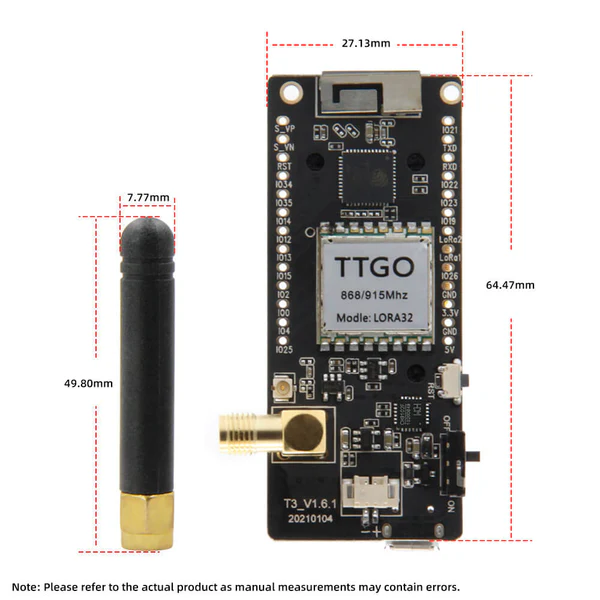

# RocketStation-LoRa32 (Récepteur NectarMC)

**RocketStation-LoRa32** est une station au sol de réception LoRa destinée à capter la télémétrie de fusées expérimentales et de ballons-sondes. Elle repose sur la carte de développement **LilyGO TTGO T3 V1.6.1 (LoRa32 V2.1.6)** équipée d'un microcontrôleur ESP32, d'un module radio SX1276 et d'un écran OLED intégré. Elle fonctionne à la fréquence de 869.525 MHz.

Cette version du logiciel est optimisée pour être compatible avec le logiciel de traitement de télémétrie **NectarMC** en générant des trames binaires série conformes, en gérant dynamiquement les trackers et en enregistrant l'historique sur carte SD.

---

## 📸 Aperçu du Matériel

Voici les vues de la carte électronique et son brochage (Pinout) :

<p align="center">
  
  
</p>
<p align="center">
  
</p>

---

## 🚀 Fonctionnalités principales

*   **Compatibilité NectarMC** : Génère à la volée des trames binaires série structurées (Magic byte `0xEB`, `Id_mission` codé sur 16 bits en Little-Endian, calcul du `CRC16-CCITT` en Little-Endian) prêtes à être lues par NectarMC.
*   **Réception LoRa dynamique** : Supporte des longueurs de paquets LoRa variables de manière totalement transparente.
*   **Robustesse radio** : Utilise le CRC matériel du module SX1276 pour garantir l'intégrité de la liaison RF (les trames corrompues en vol sont directement jetées par le silicium).
*   **Journalisation CSV incrémentale** : Crée un fichier par session de démarrage (`/log_0.csv`, `/log_1.csv`, etc.) pour éviter d'écraser vos données de vol précédentes.
*   **Suivi de l'alimentation** : Mesure la tension de la batterie en temps réel (via le pin ADC GPIO 35) et détecte si la station est alimentée en USB.

---

## 📺 Description de l'Affichage OLED et des Menus

L'écran OLED (128x64 pixels) affiche des informations complètes sur l'état de fonctionnement du récepteur. Au démarrage, il affiche une **animation de pylône radio émetteur** avec des ondes électromagnétiques clignotantes, puis affiche un retour visuel sur l'état de la carte SD (un **icône de coche de validation** en cas de succès, ou un **triangle d'alerte clignotant** si la carte est absente/défectueuse).

Pendant le fonctionnement, l'écran est structuré en deux parties :

### 1. En-tête Persistant (Ligne 1 - Toujours visible)
*   **Gauche** : Compteur de paquets reçus (et d'erreurs éventuelles), ex: `RX: 12` ou `RX:12 E:2`.
*   **Milieu** : Statut de l'alimentation. Affiche `USB` avec une icône de batterie pleine s'il est alimenté par câble USB, ou affiche la tension de la batterie en volts (ex: `3.9V`) avec une icône de jauge proportionnelle au niveau de charge.
*   **Droite** : Horloge temps réel (RTC) comptant le temps écoulé depuis le démarrage (`HH:MM:SS`).

<p align="center">
  
  
</p>

### 2. Rotation des Écrans Principaux (Alternance toutes les 4 secondes)
*   **Écran 1 (Dernière trame reçue)** :
    *   *SSID / APID* (ex: `FX99 (APID:7)`)
    *   *RSSI* physique (ex: `RSSI: -85.00 dBm`)
    *   *SNR* physique (ex: `SNR: 9.50 dB`)
*   **Écran 2 (Configuration Radio & Flux)** :
    *   *Fréquence LoRa* configurée (`LoRa @ 869.525 MHz`)
    *   *Modulation* (`SF: 8 | BW: 250 kHz`)
    *   *Statistiques réseau* : Nombre d'émetteurs actifs détectés et débit de données instantané (ex: `Trackers: 2 | 34 B/s`).

---

## 🛰️ Structure des trames LoRa (Émetteurs)

Pour que la station puisse router dynamiquement les trames vers NectarMC, les émetteurs/trackers doivent envoyer un paquet radio LoRa structuré comme suit :

| Position | Type | Rôle | Description |
| :--- | :--- | :--- | :--- |
| **Octet 0** | `uint8_t` | `SSID_NUM` | ID ou numéro de la mission (de 0 à 255) |
| **Octet 1** | `uint8_t` | `APID` | Type d'application / de paquet (de 0 à 63) |
| **Octet 2** | `uint8_t` | `SSID_TYPE` | Type de mission (`0` = FX, `1` = MF, `2` = BALLOON, `3` = OTHER) |
| **Octets 3 à L-1** | `uint8_t[]` | `Payload` | Données brutes des capteurs (taille variable L-3) |

---

## 💻 Format de trame série NectarMC (Sortie USB)

Les trames émises par la station sol vers le PC sur le port série USB ont la structure binaire suivante (taille totale : $6 + N$ octets) :

```
┌───────────────────────────────────────────┬──────────────┬─────────────────┐
│                 HEADER                    │   PAYLOAD    │ PACKET CONTROL  │
├───────────────────────────────────────────┼──────────────┼─────────────────┤
│   MAGIC     │  Id_mission  │ payload_size │   N bytes    │     CRC16       │
│   1 Byte    │   2 Bytes    │   1 Byte     │              │    2 Bytes      │
│    0xEB     │ (Little-End) │              │              │  (Little-End)   │
└─────────────┴──────────────┴──────────────┴──────────────┴─────────────────┘
```

*   **MAGIC** : `0xEB` (Marqueur de synchronisation).
*   **Id_mission** : Fusion du SSID (TYPE sur bits 15-14, NUM sur bits 13-6) et de l'APID (bits 5-0) sur 16 bits.
*   **payload_size** : Nombre d'octets $N$ de données utiles (sans l'en-tête LoRa).
*   **CRC16** : Calculé sur le Header + Payload (polynôme CCITT 0x1021, init 0xFFFF).

---

## 💾 Structure des logs (Carte SD)

Les données sont enregistrées dans un fichier CSV avec la structure suivante :
`Timestamp,RSSI,SNR,SSID,APID,RawFrame`

Exemple de ligne de log :
`00:05:42,-85.00,8.50,FX99,7,EBC7181401020304`

---

## 🛠️ Compilation et Flashage

Le projet utilise **PlatformIO**. Pour compiler et flasher le récepteur :

1. Ouvrez le projet dans VS Code avec l'extension PlatformIO.
2. Connectez votre carte TTGO LoRa32 v2.1.6 via USB.
3. Lancez la compilation et le téléversement (Upload).

En ligne de commande :
```powershell
pio run -t upload
```

---

## 👥 Auteur

*   **Paul Miailhe** - Juin 2023 (Version MSE originale).
*   Mis à jour en Mai 2026 pour la compatibilité NectarMC, l'animation d'en-tête OLED, le suivi de tension de batterie et les retours carte SD graphiques.
